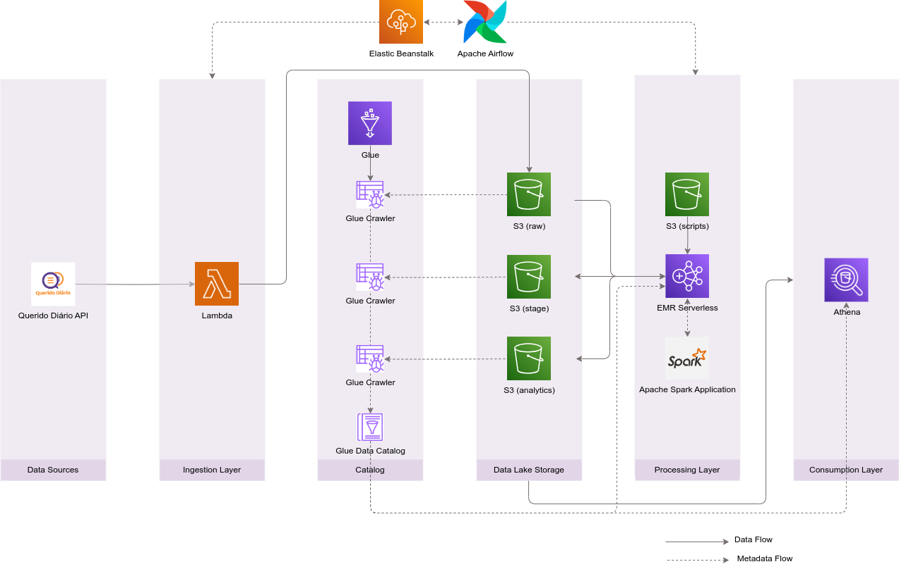
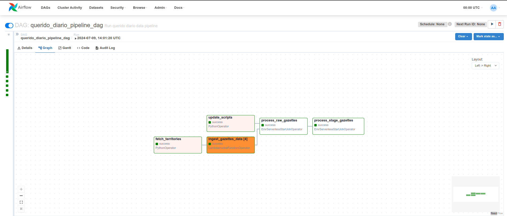
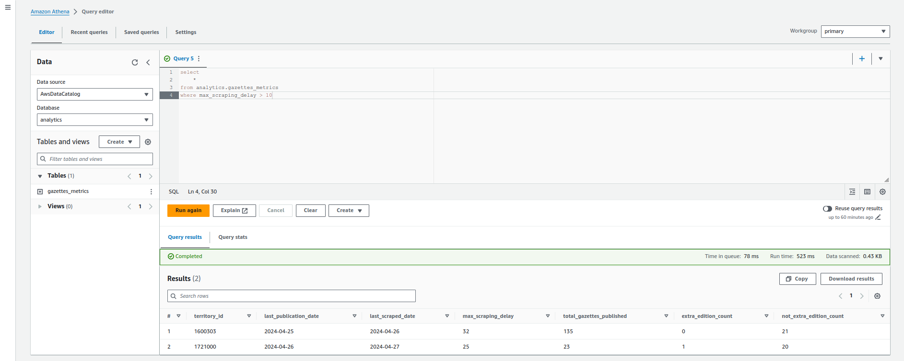

# political-data-lake

End to end data lake project to analyze the brazilian political scenario using open source tools and AWS services.

## Architecture

The project architecture is represented in the diagram below:



All the project is orchestrated by [Airflow](https://airflow.apache.org).
The Airflow contains a DAG that invokes a [AWS Lambda](https://aws.amazon.com/lambda/) function that ingests data from the sources and stores it in a [AWS S3](https://aws.amazon.com/s3) bucket. Currently only [Querido Diário](https://queridodiario.ok.org.br) source is supported.

There are one bucket for each data lake layer: raw, stage, and analytics. Each bucket has a [AWS Glue](https://aws.amazon.com/glue) crawler that creates a table in the catalog for the data stored in the bucket.

The Airflow submit Spark jobs to the [EMR serverless](https://aws.amazon.com/emr/serverless/) that transforms data across layers.
Tables can be queried through [AWS Athena](https://aws.amazon.com/pt/athena/).

The infrastructure in AWS is automated and managed using [Terraform](https://www.terraform.io) scripts. In the case of font `Querido Diário`, the DDL scripts can be found in the [assets](./assets/) folder. The processing scripts are in the [/orchestration/dags/querido_diario/scripts/](./orchestration/dags/querido_diario/scripts/) folder.

## Usage
The project is divided into storage, orchestration, ingestion, processing and catalog folders. Each part has its own README file with instructions on how to deploy and use it.

The terraform tool is used to deploy the services in AWS.
To run the terraform scripts, you need to have a profile named `politicaldatalake` in your `~/.aws/credentials` file.

1. Set up the profile with the following command:
```sh
aws configure --profile politicaldatalake
```

2. Set up the infrastructures located in the subfolders following the instructions of the respective README files and in the following order:

    1. storage
    2. ingestion
    3. catalog
    5. processing
    4. orchestration

3. Access Airflow at the address displayed in the orchestration terraform output,unpause and trigger the `querido_diario_pipeline_dag` DAG.



4. Query tables using Athena


